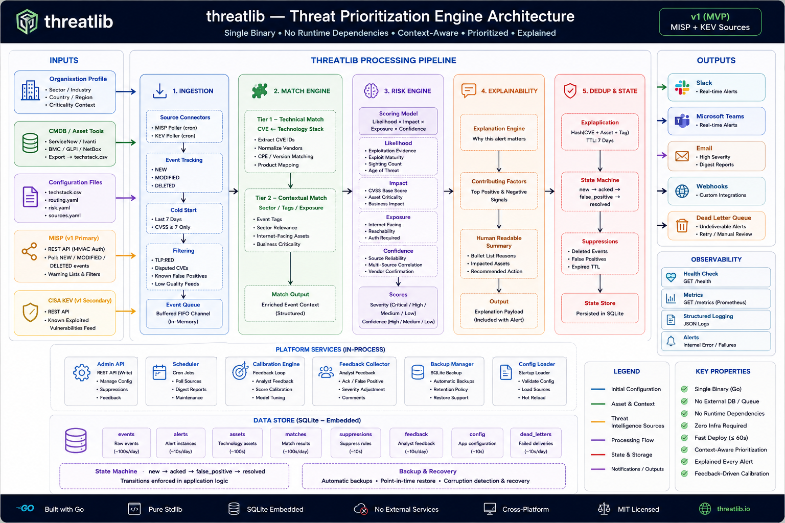

# Threat Intel Arbiter — Threat Prioritization Engine

**Deploy in 60 seconds. Single Go binary. Zero dependencies.**

Threat Intel Arbiter transforms raw threat intelligence into organisation-specific, scored, and explained actions. It answers one question:

> **Should this organisation care about this threat right now?**

Every alert includes: **Severity** + **Confidence** + **Action** + **Explanation** with full score breakdown.

**SSVC action labels** tell you what to do: Act Now / Schedule / Track / Monitor.
**Threat tagging** enriches events with ATT&CK techniques + threat actors (offline, zero deps).
**Per-source confidence** shows which sources contributed to the score.

---

## How it works

```
MISP ─┐
CISA KEV ─┤──► Normalize ──► Filter ──► Match ──► Score ──► Explain ──► Route ──► Slack/Teams/Email
```

1. **Pull** threat intel from MISP and CISA KEV
2. **Filter** false positives via warning lists
3. **Match** CVEs against your tech stack (pluggable matchers)
4. **Score** risk using 4 dimensions: Likelihood × Impact × Exposure × Confidence
5. **Explain** exactly why — with evidence and score breakdown
6. **Route** by severity + confidence to Slack, Teams, or Email

---

## Quick Start

```bash
# Build
go build -o arbiter ./cmd/arbiter/

# Configure
cp config/techstack.csv.example config/techstack.csv   # Your app inventory
# Edit config/sources.yaml with your MISP URL
# Set MISP_API_KEY env var

# Run
export MISP_API_KEY="your-key"
./arbiter --config ./config/
```

---

## Configuration

Threat Intel Arbiter is entirely configuration-driven. No database UI needed.

| File | Purpose |
|------|---------|
| `config/techstack.csv` | Your application inventory (name, version, vendor, criticality, exposure) |
| `config/sources.json` | Threat source connections (MISP URL, KEV enabled) |
| `config/routing.json` | Alert routing rules (severity + confidence → Slack/Teams/Email) |
| `config/risk.json` | Risk dimension weights and thresholds |
| `config/matchers.json` | Enabled matchers and their config |
| `config/org.json` | Organisation profile (sector, country, timezone) |

---

## Architecture

- **Single Go binary** — no dependencies, no runtime, no Docker
- **Multi-source from day 1** — canonical ThreatEvent model, sources are pluggable normalizers
- **Pluggable matchers** — CVEMatcher, SectorMatcher, KEVMatcher in v1
- **Risk engine** — 4-dimension scoring with explainability
- **Confidence-aware routing** — high severity + low confidence routes differently
- **False-positive feedback loop** — calibration quality improves over time



> [Interactive architecture diagram →](docs/architecture.html)
> [Complete design document →](docs/design.md)

---

## Tech stack

| Component | Technology |
|-----------|-----------|
| Language | Go 1.25+ |
| HTTP | net/http (stdlib) |
| Database | SQLite (pure Go, no CGO) |
| Auth | net/http middleware |
| SMTP | net/smtp (stdlib) |
| Dependencies | **1** (modernc.org/sqlite) |

---

## v1 Sources

- **MISP** — REST API with HMAC-SHA256 auth (primary)
- **CISA KEV** — Known Exploited Vulnerabilities catalog (secondary, free, no auth)

v2 roadmap: GitHub Advisory, NVD API, vendor feeds.

---

## Deployment

```bash
go build -o arbiter ./cmd/arbiter/
# → 15MB static binary
# → Copy to any Linux/macOS/Windows machine
# → Run. Done.
```

No Docker. No Postgres. No Redis. No Python. No Node.

---

## License

MIT
